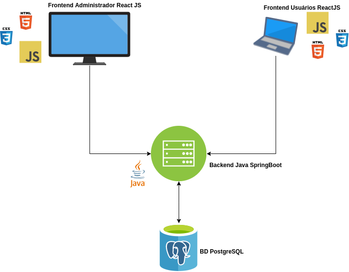

# QA-FullStack

Este projeto tem como objetivo desenvolver conceitos iniciais de desenvolvimento *fullStack*, para que o analista de teste tenha um conhecimento de como é realizado o desenvolvimento de software.

Para a prática será usado um projeto para o desenvolvimento de um sistema de feedback, onde há um administrador que poderá enviar listas de atividades para o colaborador desenvolver, bem como feedbacks de como está seu progresso na empresa.

O projeto será desenvolvido o banco em [Postgres](https://www.postgresql.org/), para o backend será usado o *framework* em Java [*SpringBoot*](https://spring.io/projects/spring-boot) e para o *frontend* é usado a biblioteca [*React*](https://pt-br.reactjs.org/).

## Estrutura do repositório

- `db-project`: encontra-se os arquivos `.sql` com os scripts do banco desenvolvido.
- `exercicios-db`: encontra-se um `Readme.md` com exerícios que devem ser realizados no arquivo `script.sql`.
- `sistema-feedback`: projeto do *frontend* em *ReactJs*.
- `spring-system-feedback`: há o projeto do *backend* em Java *SpringBoot*.

## Configurações do projeto.

Para que o sistema funcione localmente, deve ter como pré-requisito a instalação das seguintes ferramentas:

- [Instalação do Postgres](http://www.bosontreinamentos.com.br/postgresql-banco-dados/instalacao-do-postgresql-no-microsoft-windows/)

- [Instalação do DBeaver](https://dbeaver.io/download/)

- [Instalação do Node](https://www.devmedia.com.br/como-instalar-o-node-js-npm-e-o-react-no-windows/40329)

- Instalação do projeto em ReactJS: `npx create-react-app sistema-feedback`

- [Instalação do Java](https://medium.com/@mauriciogeneroso/configurando-java-1-instala%C3%A7%C3%A3o-do-jre-e-do-jdk-no-windows-38cacace0377)

- [Instalação do Maven](https://helpdevs.net/2020/01/04/como-instalar-maven-windows/)

- [Instalação do Intellij Community](https://www.jetbrains.com/idea/download/)

- [Criação do projeto do Java Spring Boot](https://start.spring.io/)

## Prática do Projeto

Para a prática do projeto *QA-FullStack* é desenvolvido um sistema de *feedbacks* na qual o líder realiza o cadastro do colaborador e este pode visualizar seus *feedbacks* de sua máquina e acompanhar sua *checklist* de tarefas que ele deve desenvolver dentro da empresa. Nas subseções há a arquitetura do projeto.

### Arquitetura

1. Banco de dados em PostgreSQL, contendo as seguintes coleções de dados;
    - O líder (administrador) poderá armazenar informações pessoas do colaborador como nome completo, nome de usuário, senha, endereço, celular e demais informações;
    - O líder (administrador) poderá armazenar informações a seu respeito como nome completo, nome de usuário, senha, endereço, celular e demais informações;
    - O líder para cada colaborador poderá cadastrar *checklists* contendo passos que o colaborador deve realizar dentro da empresa. O líder poderá escolher de deixar ou não este *checklist* público para que o colaborador visualize seu checklist;
    - O líder para cada colaborador poderá cadastrar vários *feedbacks* contendo inúmeras informações relativos ao comportamento do colaborador. O líder poderá escolher se deixa ou não visível para o colaborador.
    O colaborador poderá acessar o sistema de *feedback* e visualizar os *checklists* e *feedbacks* que foram marcados como público pelo líder. 
2. O segundo passo consiste na criação do *backend* em Java `SpringBoot` para externalizar e alimentar o *frontend* com as informações persistidas no banco de dados.
    - O *backend* deve persistir as tabelas do banco de dados;
    - O *backend* deve prover *endpoint* para o líder realizar o login no sistema;
    - O *backend* deve prover *endpoint* para o colaborador realizar o login no sistema;
    - O *backend* deve prover *endpoint* para o líder realizar o cadastro de *feedbacks*;
    - O *backend* deve prover *endpoint* para o líder realizar o cadastro de *checklist*;
    - O *backend* deve prover *endpoint* para o líder visualizar todos os *feedbacks* e *checklist* dos colaboradores;
    - O *backend* deve prover *endpoint* para o colaborador visualizar seus *feedbacks* e *checklists*
3. O terceiro passo é a criação do *frontend* que apresentará as informações para os usuários e será porta de acesso para cadastro de novas informações no sistema de *feedback*.
    - O *frontend* deverá ter uma tela de login para o líder;
    - O *frontend* deverá ter uma tela de login para o colaborador;
    - O *frontend* deverá ter uma tela para o líder cadastrar informações do colaborador;
    - O *frontend* deverá ter uma tela para o líder gerenciar os *feedbacks* e *checklist* dos usuários
    - O *frontend* deverá ter uma tela que o colaborador visualiza as informações que são públicas para ele.

# Referências

- [JavaSpringBoot](https://docs.spring.io/spring-boot/docs/current/reference/htmlsingle/)

- [React](https://pt-br.reactjs.org/)

- [PostgreSQL](https://www.postgresql.org/docs/)

- [Introdução Banco de Dados](./img-readme/bd.pdf)

- [Java Orientado a Objetos](https://www.caelum.com.br/download/caelum-java-objetos-fj11.pdf)

- [Guia introdução aos conceitos HTTP e REST](https://code.tutsplus.com/pt/tutorials/a-beginners-guide-to-http-and-rest--net-16340)